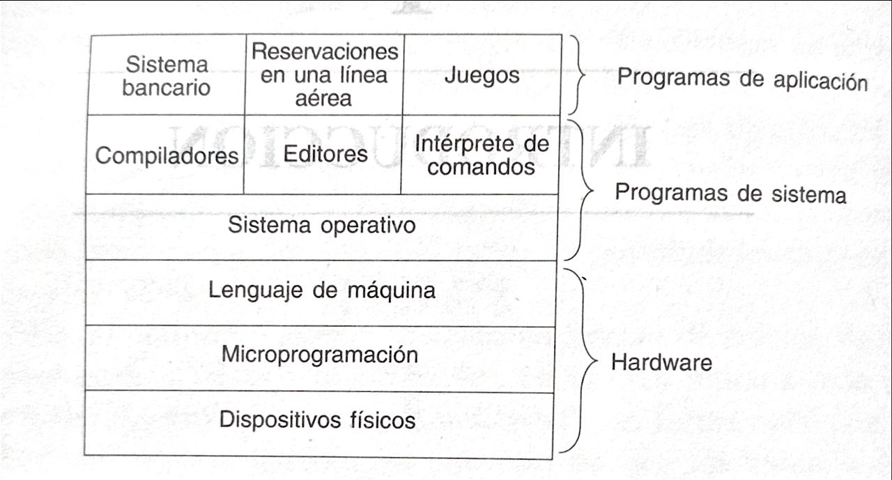

# Estructura Básica de una Computadora (basado en el software)

Sabemos que una **computadora** está compuesta principalmente por **hardware** y **software**. En principio, el **hardware** es el conjunto de componentes **físicos**, y el **software** son los programas.

Esta explicación es muy básica y se pierden muchos detalles valiosos. Aquí se revisará la estructura de la computadora con un enfoque en el software.

En la siguiente imagen se muestra la estructura básica de la computadora:

<div style="text-align: left;">
     
</div>

Dijimos que la computadora está compuesta por **hardware** y **software**.

## Hardware

En el **hardware** tenemos las siguientes capas:

> Estas capas están organizadas de la más profunda a la más superficial.

- **Componentes físicos:** Tenemos el procesador (**CPU**), memoria principal, memoria secundaria, dispositivos de **E/S** (Entrada/Salida), entre otros.

- **Microprograma:** Se trata de un **software primitivo** para diseñar la unidad de control de cualquier sistema digital, a partir de una secuencia de instrucciones (**microinstrucciones**) o estructuras de datos.

    - El microprograma se cataloga como un tipo particular de **firmware** y se localiza, por lo general, en la **ROM**.
    - Las microinstrucciones son secuencias de datos binarios que representan señales eléctricas internas que controlan la ejecución de las instrucciones.

- **Lenguaje de máquina:** Es el conjunto de instrucciones visibles para el programador (o el compilador), pero que son interpretadas y ejecutadas internamente por el microprograma.

    - El lenguaje de máquina no se ejecuta directamente sobre el hardware. En su lugar, el microprograma lo descompone en **microinstrucciones**, que son señales eléctricas para activar registros, la **ALU**, etc.

## Software

Recordemos que en el [vita previa del README](../../README.es.md) mencionamos que el software se divide en dos: **programas de sistema** y **programas de aplicación**.

### Programas de sistema

- **Sistema operativo:** [Revisa la definición aquí.](F01-Definicion.md)

- **Otros programas de sistema:** Son softwares del sistema que **no** son el sistema operativo. Aquí se encuentran el intérprete de comandos (**shell**), compiladores, editores de texto, etc.

    - Hay que destacar que estos programas **no son parte del sistema operativo**, a pesar de que los fabricantes los proporcionan en conjunto.
    - Por ejemplo, **Microsoft Edge** viene instalado con Windows, pero no forma parte del sistema operativo. Lo mismo ocurre con **Firefox** en Linux o **Safari** en macOS.

### Programas de aplicación

- **Programas de aplicación:** Son aquellos diseñados para el usuario final. Por ejemplo: **Spotify, Fortnite, Google Maps**, etc.

## Modos de Operación de Computadoras

La mayoría de las computadoras tienen dos modos de ejecución: el **modo kernel** (o modo supervisor) y el **modo usuario**.

### Modo kernel

- El sistema operativo se ejecuta en **modo kernel**.
- En este modo, tiene acceso completo a todo el **hardware** y puede ejecutar cualquier instrucción que la máquina sea capaz de ejecutar.
- Además, está **protegido** contra alteraciones por parte del usuario.

### Modo usuario

- El resto del software (aplicaciones) se ejecuta en **modo usuario**.
- En este modo, solo un **subconjunto de instrucciones** está permitido.
    - Por ejemplo: Un usuario puede crear su propio compilador, pero **no** puede escribir su propio controlador de interrupciones de disco, ya que está protegido por el modo kernel.

  
## Jerárquia dentro de la estructura 

```plaintext
Usuario
│
└── Programas de Aplicación (Modo Usuario)
    │ Ej: Chrome, Word, Spotify
    │
    └── Otros Programas de Sistema (Modo Usuario)
        │ Ej: Compiladores, Shell, Editores
        │
        └── Sistema Operativo (Modo Kernel)
            │ Kernel, Drivers, Syscalls
            │
            └── Lenguaje de Máquina
                │ ADD, MOV, JMP (interpretadas)
                │
                └── Microprogramación
                    │ Microcódigo (CPU/BIOS)
                    │
                    └── Hardware
                        │ CPU, RAM, Disco
```