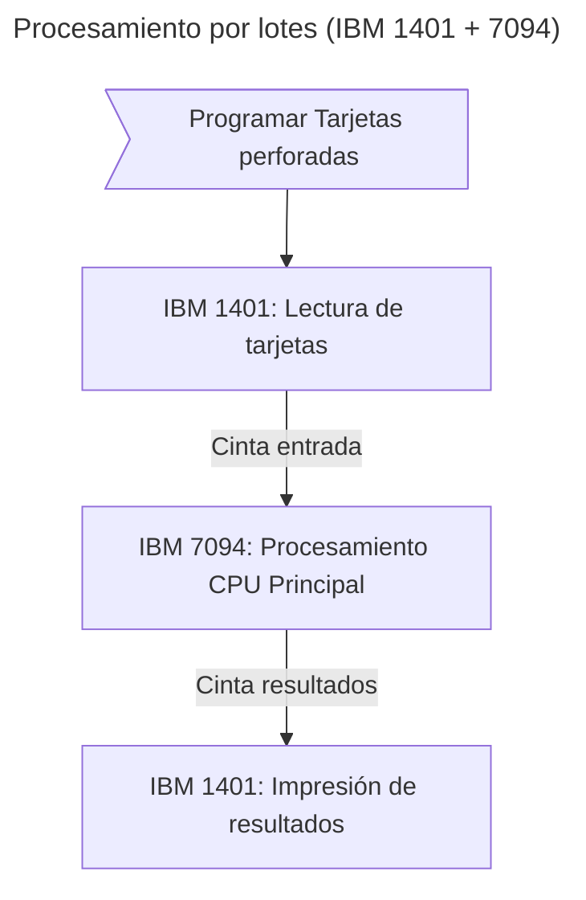

# Historia de los Sistemas Operativos

Los sistemas operativos han ido evolucionando con el pasar del tiempo. La historia de los sistemas operativos esta profundamente relacionada con la historia de las computadoras. Anteriormente hice un repositorio de [Organizacion del Computador](https://github.com/Badjavii/Core-Compu) en donde se habla de la [historia de las computadoras](https://github.com/Badjavii/Core-Compu/blob/main/S01-Computer-Organization/F01.1-Computer-Organization.es/D02-Historia-Del-Computador.md) y puedes revisarlo. Sin embargo, veremos un breve repaso de sus generaciones.

Recordemos que antes del siglo XX tuvimos ciertos antecedentes de lo que luego se llamaría Computadora. Los antecedentes mas relevantes fueron:
- **El abaco:** Creado en el 500 a.C.
- **Pascalina:** Una maquina que fue creada por Shails Pascal en 1641.
- **Telar de Jacquard:** Un telar mecánico que utilizaba tarjetas perforadas. Fue inventado por Joseph Jacquard en 1801.
- **Maquina diferencial:** Lograba calcular polinomios, pero su inventor, Charles Babbage, no logro terminarla en 1822.
- **Maquina analítica:** En 1833, Charles Babbage diseñó un prototipo de computadora mecánica programable, y Lady Ada Lovelace (matemática y escritora) escribió un algoritmo para esa maquina. Lovelace se convirtió en la **primera programadora**, mientras que Babbage se convirtió en el **Padre de la computación**.
- **Maquina Tabuladora Eléctrica:** Creada en 1889 por Herman Hollerith. Fue crucial en el desarrollo del procesamiento de datos. Herman Hollerith es considerado el **Padre de la Informatica**.
- **Maquina de Turing:** Un prototipo conceptual de máquina que puede realizar cualquier cálculo que pueda ser expresado por medio de un algoritmo. Alan Turing se convirtió en el **Padre de la informatica moderna.**

Cabe destacar que ninguna de estas maquinas eran electrónicas, por lo que, obviamente **no contaban con un sistema operativo.**

## Primera generación (1945-1955): Tubos de vacío y conexiones

Las computadoras electrónicas nacen. Las mas relevantes fueron la Z1 (Konrad Zuse), la ENIAC (J. Presper y William Mauchley), UNIVAC, la Mark 1 (Howard Aiken), ABC (John Atanasoff y Clifford Berry) y la EDVAC (Von Neumann). Todas estas fueron maquinas de calculo que usaban componentes electrónicos que utilizan el vacío para controlar el flujo de electrones (y la corriente eléctrica). Esos componentes son los tubos de vacío.

En aquella época, la operación de un computador era muy complejo y tardaba demasiado. Las primeras computadoras se operaban a través de **conexiones** que vendrían siendo cableados físicos que se tenían que cambiar manualmente. Las computadoras podían tener cientos de conexiones y estas tenían que ser reconfiguradas con frecuencia y eso implicaba a el uso de muchas personas para operar una sola computadora. No existían los lenguajes de programación y mucho menos los sistemas operativos.

A finales de la década de los 50, se dio la transición de las conexiones a las tarjetas perforadas.

## Segunda generación (1955-1965): Transistores y sistemas de procesamiento por lotes

Gracias a los transistores, las computadoras se hicieron mas precisas, rápidas y confiables. Tambien nacieron los primeros lenguajes de programación y, por primera vez, hubo una separación entre fabricantes, programadores, operadores y mantenimiento.

Las maquinas eran bastante costosas y eran pocas las organizaciones que podían adquirirlas. Para ejecutar un programa, el programador debía escribirlo en hojas de papel (en FORTRAN o ensamblador) para despues perforar las tarjetas. Este proceso manual generaba enormes ineficiencias: los operadores perdían hasta el 50% del tiempo caminando entre salas para cargar programas, compiladores y datos en sistemas como el IBM 1401/7094, donde la CPU permanecía ociosa durante estos cambios.

La solución fue el procesamiento por lotes automatizado: los trabajos se recolectaban en cintas magnéticas que luego se procesaban secuencialmente sin intervención humana. El IBM 1401 manejaba la entrada/salida mientras el 7094 hacía los cálculos, aumentando la utilización de CPU del 30% al 85%. Este sistema sentó las bases para los primeros sistemas operativos con monitores residentes que gestionaban la transición automática entre trabajos.

Las computadoras de la segunda generación, por lo general, se programaban en FORTRAN (Formula translator) y en lenguaje ensamblador. Los sistemas operativos más comunes eran **FMS (Fortran Monitor System)** e **IBSYS (IBM System para el 7094)**. 

## Tercera generación (1965-1980): Circuitos integrados y multiprogramación

La industria de la computación se había estandarizado en dos líneas de productos: computadoras científicas (como la 7094) y las computadoras comerciales (como la 1401).

IBM introdujo la serie 360 que contaba con software compatible. En principio, las máquinas tenían la misma arquitectura y el mismo conjunto de instrucciones, por lo que los programas escritos en una máquina podían ejecutarse en otras máquinas.

La serie 360 fue de las primeras en implementar circuitos integrados que mejoraron aún más el rendimiento de las computadoras con respecto a la segunda generación. La idea de IBM de las computadoras compatibles fue un éxito y se adoptó por los demás fabricantes. Sin embargo, esta idea tenía muchos problemas. Tan solo imaginemos desarrollar todo el software (incluido el sistema operativo) y que funcione en todos los modelos de computadoras. El resultado fue un sistema operativo monstruoso (de magnitud doble o triple que FMS) que tenía millones de líneas de código y miles de errores. Este sistema operativo se llamaba OS/360.

El OS/360 y otros sistemas operativos similares de otros fabricantes lograron satisfacer las necesidades de los clientes. Por otro lado, estos mismos sistemas operativos popularizaron técnicas avanzadas como la **multiprogramación**.

Las computadoras aún tenían unos problemas de ejecución. Los trabajos en curso se pausaban en espera de una cinta o de un valor de entrada/salida y la CPU quedaba inactiva en esos momentos. Para las computadoras usadas en cálculo científico, el tiempo perdido era insignificante ya que las entradas/salidas eran pocas. Pero, en las computadoras usadas para procesamiento de datos comerciales, el CPU permanecía inactivo el 80% del tiempo de ejecución total. Por eso implementaron la idea de dividir la memoria en distintas particiones (o módulos), donde mientras un trabajo espera la entrada/salida, el CPU estará ejecutando el siguiente trabajo. Si todos los trabajos entran dentro de la memoria, entonces la CPU estaría trabajando el 100% del tiempo de ejecución. Esto fue la multiprogramación y requería un hardware específico, pero las computadoras de esta generación contaban con ello.

Los sistemas operativos de esta generación contaban con otras características como el spooling y el tiempo compartido.

> **Spooling:** Fue una técnica importante para optimizar el uso de la memoria y los recursos periféricos. Se utilizaba para almacenar trabajos de entrada y salida (como datos de impresión) temporalmente en un área de memoria (spool) antes de que fueran procesados por un dispositivo. Esto permitía que la CPU continuara trabajando en otras tareas sin tener que esperar a que el dispositivo periférico lento completara su tarea, mejorando así la eficiencia del sistema.

> **Tiempo compartido:** Permitía que múltiples usuarios interactuaran simultáneamente con una misma máquina. Esto se lograba mediante técnicas de multiprogramación. Gracias a la multiprogramación, el sistema operativo programaba la ejecución de varios programas de manera simultánea, creando la ilusión de que cada usuario tenía la computadora para sí solo.

Luego del éxito del tiempo compartido, Bell Labs, el MIT y General Electric se unieron para el proyecto **MULTICS** con la idea de que una máquina ofreciera tiempo compartido a cientos de usuarios. Sin embargo, la idea fracasó.

Surgieron las minicomputadoras, lideradas por la DEC PDP-1 que fue un éxito. La serie de PDP era, en principio, incompatible entre sí, por lo que el software para una PDP-1 no funcionaba para una PDP-4. Dos científicos de Bell Labs, Ken Thompson y Dennis Ritchie, en conjunto crearon un sistema operativo parecido a MULTICS para una minicomputadora PDP-7. Este sistema operativo fue **UNIX** y dominó el mercado de minicomputadoras, entre otros muchos.

> Ken Thompson fue un trabajador del proyecto MULTICS y Dennis Ritchie fue el creador del lenguaje de programación C.

## Cuarta generación (1980-1990): Computadoras personales

Las computadoras personales (o microcomputadoras) surgieron gracias al desarrollo de chips con miles de transistores en un centímetro cuadrado de silicio. Esos chips eran conocido como los **circuitos integrados de larga escala** o **microprocesadores**. La arquitectura era la misma que la de los minicomputadores, pero se logró minimizar al punto de que cada individuo podía tener su propia computadora.

La industria de las computadoras personales iba destinado a usuarios que no sabían nada de computadoras. Entonces la experiencia de usuario era la prioridad a la hora de desarrollar software para computadoras personales. El software tenia que ser amigable e intuitivo.

> En esta generación surgió la aclamada empresa **Apple Computers** y debutó con su Apple II, una computadora personal que fue un éxito comercial cuyo sistema operativo fue **Apple DOS**. Unos años después, IBM se introdujo en la industria de la computadora personal con la IBM PC. IBM necesitaba un sistema operativo para su PC y optaron por **MS-DOS (Microsoft Disk Operating System)**.

Los sistemas operativos más populares para computadoras personales fueron **MS-DOS** y **UNIX**.

Cabe mencionar que en esta generación se comenzó a desarrollar lo que serian los **sistemas operativos de red** y los **sistemas operativos distribuidos**. Un sistema operativo distribuido administra un conjunto de computadoras independientes como un sistema unificado, mientras que un sistema operativo de red se enfoca en la administración de una red y la gestión de recursos compartidos.

