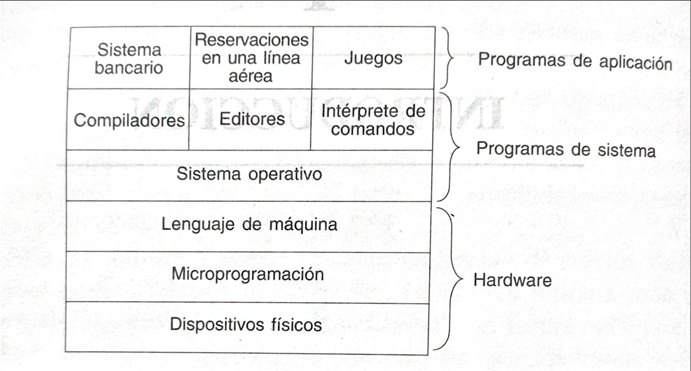

# Basic Computer Structure (Software-based)

We know that a **computer** is primarily composed of **hardware** and **software**. Essentially, the **hardware** is the set of **physical components**, and the **software** consists of programs.

This explanation is very basic and misses many valuable details. Here we'll review the computer structure with a focus on software.

The following image shows the basic computer structure:

<div style="text-align: left;">
     
</div>

As mentioned, the computer consists of **hardware** and **software**.

## Hardware

In the **hardware** we have the following layers:

> These layers are organized from deepest to most superficial.

- **Physical components:** Includes the processor (**CPU**), main memory, secondary memory, **I/O** (Input/Output) devices, among others.

- **Microprogram:** This is a **primitive software** for designing the control unit of any digital system, based on a sequence of instructions (**microinstructions**) or data structures.

    - The microprogram is classified as a particular type of **firmware** and is generally located in **ROM**.
    - Microinstructions are sequences of binary data representing internal electrical signals that control instruction execution.

- **Machine Language:** This is the set of instructions visible to the programmer (or compiler), but which are internally interpreted and executed by the microprogram.

    - Machine language is not executed directly on the hardware. Instead, the microprogram breaks it down into **microinstructions**, which are electrical signals to activate registers, the **ALU**, etc.

## Software

Recall from the [README preview](../../README.md) that software is divided into two categories: **system programs** and **application programs**.

### System Programs

- **Operating System:** [See definition here.](F01-Definition.md)

- **Other System Programs:** These are system software that are **not** part of the operating system. This includes the command interpreter (**shell**), compilers, text editors, etc.

    - It's important to note that these programs **are not part of the operating system**, even though manufacturers often bundle them together.
    - For example, **Microsoft Edge** comes installed with Windows but isn't part of the operating system. The same applies to **Firefox** in Linux or **Safari** in macOS.

### Application Programs

- **Application Programs:** These are designed for end users. Examples include: **Spotify, Fortnite, Google Maps**, etc.

## Computer Operation Modes

Most computers have two execution modes: **kernel mode** (or supervisor mode) and **user mode**.

### Kernel Mode

- The operating system runs in **kernel mode**.
- In this mode, it has complete access to all **hardware** and can execute any instruction the machine is capable of.
- Additionally, it is **protected** against user modifications.

### User Mode

- All other software (applications) runs in **user mode**.
- In this mode, only a **subset of instructions** is permitted.
    - For example: A user can create their own compiler, but **cannot** write their own disk interrupt handler, as this is protected by kernel mode.

## Hierarchy Within the Structure

```plaintext
User
│
└── Application Programs (User Mode)
    │ Examples: Chrome, Word, Spotify
    │
    └── Other System Programs (User Mode)
        │ Examples: Compilers, Shell, Editors
        │
        └── Operating System (Kernel Mode)
            │ Kernel, Drivers, System Calls
            │
            └── Machine Language
                │ ADD, MOV, JMP (interpreted)
                │
                └── Microprogramming
                    │ Microcode (CPU/BIOS)
                    │
                    └── Hardware
                        │ CPU, RAM, Disk
```
