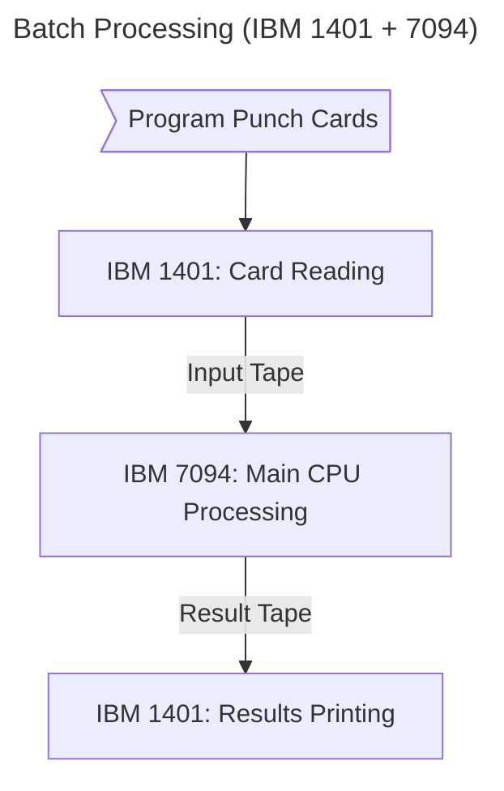

# History of Operating Systems

Operating systems have evolved over time. The history of operating systems is closely related to the history of computers. I previously created a repository for [Computer Organization](https://github.com/Badjavii/Core-Compu) that discusses the [history of computers](https://github.com/Badjavii/Core-Compu/blob/main/S01-Computer-Organization/F01.1-Computer-Organization.es/D02-Historia-Del-Computador.md), which you can review. However, we'll briefly review its generations.

Remember that before the 20th century, we had certain antecedents of what would later be called the computer. The most relevant antecedents were:
- **The abacus:** Created in 500 BC
- **Pascaline:** A machine created by Shails Pascal in 1641.
- **Jacquard Loom:** A mechanical loom that used punched cards. It was invented by Joseph Jacquard in 1801.
- **Difference Engine:** It could calculate polynomials, but its inventor, Charles Babbage, failed to complete it until 1822.
- **Analytical Engine:** In 1833, Charles Babbage designed a prototype of a programmable mechanical computer, and Lady Ada Lovelace (mathematician and writer) wrote an algorithm for it. Lovelace became the **first programmer**, while Babbage became the **Father of Computing**.
- **Electric Tabulating Machine:** Created in 1889 by Herman Hollerith. It was crucial in the development of data processing. Herman Hollerith is considered the **Father of Computing**.
- **Turing Machine:** A conceptual prototype of a machine that can perform any calculation that can be expressed through an algorithm. Alan Turing became the **Father of Modern Computing.**

It should be noted that none of these machines were electronic, so they obviously **did not have an operating system.**

## First Generation (1945-1955): Vacuum Tubes and Connections

Electronic computers are born. The most important were the Z1 (Konrad Zuse), the ENIAC (J. Presper and William Mauchley), UNIVAC, the Mark 1 (Howard Aiken), ABC (John Atanasoff and Clifford Berry), and the EDVAC (Von Neumann). All of these were calculating machines that used electronic components that utilize vacuum to control the flow of electrons (and electric current). These components are vacuum tubes.

At that time, operating a computer was very complex and time-consuming. The first computers were operated through **connections**, which were physical wiring that had to be changed manually. Computers could have hundreds of connections, and these had to be reconfigured frequently, requiring many people to operate a single computer. Programming languages, much less operating systems, did not exist.

In the late 1950s, the transition from connections to punched cards took place.

## Second Generation (1955-1965): Transistors and Batch Processing Systems

Thanks to transistors, computers became more precise, faster, and more reliable. The first programming languages ​​were also born, and for the first time, there was a separation between manufacturers, programmers, operators, and maintenance.

The machines were quite expensive, and few organizations could afford them. To run a program, the programmer had to write it on sheets of paper (in FORTRAN or assembler) and then punch the cards. This manual process generated enormous inefficiencies: operators wasted up to 50% of their time walking between rooms to load programs, compilers, and data into systems like the IBM 1401/7094, where the CPU remained idle during these changeovers.

The solution was automated batch processing: jobs were collected on magnetic tapes, which were then processed sequentially without human intervention. The IBM 1401 handled the input/output while the 7094 performed the calculations, increasing CPU utilization from 30% to 85%. This system laid the groundwork for the first operating systems with resident monitors that managed automatic transitions between jobs.

Second-generation computers were typically programmed in FORTRAN (Formula Translator) and assembly language. The most common operating systems were **FMS (Fortran Monitor System)** and **IBSYS (IBM System for the 7094)**.

## Third Generation (1965-1980): Integrated Circuits and Multiprogramming

The computer industry had standardized on two product lines: scientific computers (such as the 7094) and business computers (such as the 1401).

IBM introduced the 360 ​​series, which featured compatible software. In principle, the machines had the same architecture and instruction set, so programs written on one machine could run on others.

The 360 ​​series was one of the first to implement integrated circuits, which further improved computer performance compared to the second generation. IBM's idea of ​​compatible computers was a success and was adopted by other manufacturers. However, this idea had many problems. Just imagine developing all the software (including the operating system) and having it run on all computer models. The result was a monstrous operating system (double or triple the size of FMS) that had millions of lines of code and thousands of bugs. This operating system was called OS/360.

OS/360 and other similar operating systems from other manufacturers managed to meet customers' needs. On the other hand, these same operating systems popularized advanced techniques such as multiprogramming.

Computers still had execution problems. Jobs in progress would pause while waiting for a tape or an input/output value, and the CPU would be idle during those moments. For computers used for scientific calculations, the wasted time was negligible since input/output was limited. However, on computers used for commercial data processing, the CPU remained idle for 80% of the total execution time. Therefore, they implemented the idea of ​​dividing memory into different partitions (or modules), where while one job waits for input/output, the CPU would execute the next job. If all the jobs fit into memory, then the CPU would be working 100% of the execution time. This was multiprogramming and required specific hardware, but computers of this generation had it.

Operating systems of this generation had other features such as spooling and time-sharing.

> **Spooling:** This was an important technique for optimizing the use of memory and peripheral resources. It was used to temporarily store input and output jobs (such as printing data) in a memory area (spool) before they were processed by a device. This allowed the CPU to continue working on other tasks without having to wait for the slow peripheral device to complete its task, thus improving system efficiency.

> **Time-sharing:** This allowed multiple users to interact simultaneously with the same machine. This was achieved through multiprogramming techniques. Thanks to multiprogramming, the operating system scheduled the execution of several programs simultaneously, creating the illusion that each user had the computer to themselves.

After the success of time-sharing, Bell Labs, MIT, and General Electric joined forces for the **MULTICS** project, with the idea of ​​​​offering a single machine time-sharing to hundreds of users. However, the idea failed.

Minicomputers emerged, led by the successful DEC PDP-1. The PDP series was, in principle, incompatible with each other, so software for a PDP-1 wouldn't work for a PDP-4. Two Bell Labs scientists, Ken Thompson and Dennis Ritchie, worked together to create a MULTICS-like operating system for a PDP-7 minicomputer. This operating system was UNIX and dominated the minicomputer market, among many others.

> Ken Thompson was a worker on the MULTICS project, and Dennis Ritchie was the creator of the C programming language.

## Fourth Generation (1980-1990): Personal Computers

Personal computers (or microcomputers) emerged thanks to the development of chips with thousands of transistors per square centimeter of silicon. These chips were known as **large-scale integrated circuits** or **microprocessors**. The architecture was the same as that of minicomputers, but was minimized to the point that each individual could have their own computer.

The personal computer industry was aimed at users who knew nothing about computers. User experience was the priority when developing software for personal computers. The software had to be user-friendly and intuitive.

> During this generation, the acclaimed company **Apple Computers** emerged and debuted its Apple II, a commercially successful personal computer whose operating system was **Apple DOS**. A few years later, IBM entered the personal computer industry with the IBM PC. IBM needed an operating system for its PC and opted for MS-DOS (Microsoft Disk Operating System).

The most popular operating systems for personal computers were MS-DOS and UNIX.

It's worth mentioning that this generation saw the development of what would become network operating systems and distributed operating systems. A distributed operating system manages a set of independent computers as a unified system, while a network operating system focuses on network administration and shared resource management.